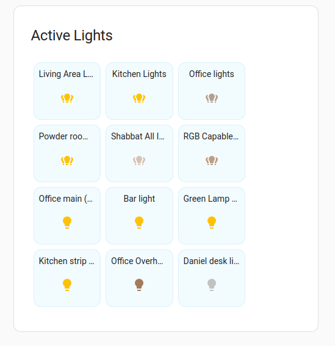
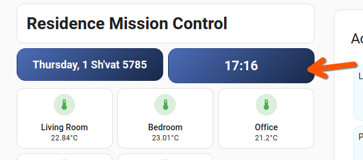
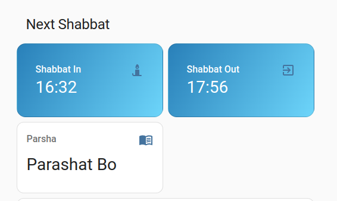
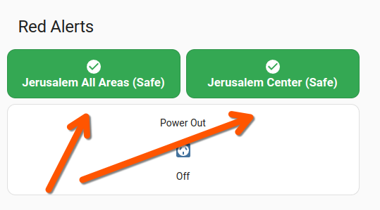
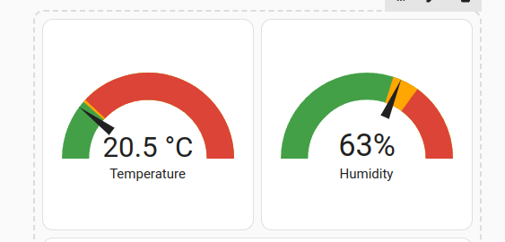

# Home Assistant Dashboard YAML Snippets

YAML snippets for Home Assistant dashboard elements.

Design: Anthropic Sonnet 3.5.

## Elements

<!-- START_THEMES -->


## Active Lights



```yaml
type: custom:auto-entities
filter:
  include:
    - domain: light
      state: "on"
show_empty: false
card:
  show_name: true
  show_icon: true
  show_state: false
  type: glance
  columns: 4
  state_color: true
  title: Active Lights
  card_mod:
    style: |
      ha-card {
        background: var(--card-background-color, var(--ha-card-background));
        border-radius: 12px;
        padding: 12px;
        margin-top: 10px;
        margin-bottom: 10px;
      }
      .header {
        font-weight: bold;
        padding: 8px 16px;
        color: var(--primary-text-color);
      }
      .name {
        font-size: 14px;
      }
      ha-card .entity {
        background: rgba(var(--rgb-primary-color), 0.05);
        border-radius: 12px;
        margin: 4px;
        padding: 8px;
        border: 1px solid rgba(var(--rgb-primary-color), 0.1);
      }
      ha-card .entity:hover {
        background: rgba(var(--rgb-primary-color), 0.1);
        transform: scale(1.02);
        transition: all 0.2s ease-in-out;
      }
sort:
  method: none
  reverse: false

```


## Hebrew Date And Time



```yaml
type: grid
columns: 2
square: false
cards:
  - type: custom:button-card
    entity: sensor.hebcal_hebrew_date
    show_name: false
    show_state: true
    show_icon: false
    styles:
      card:
        - background: "linear-gradient(135deg, #4B6CB7 0%, #182848 100%)"
        - border-radius: 15px
        - padding: 16px
      state:
        - color: white
        - font-weight: bold
        - font-size: 18px
        - text-align: center
        - justify-self: center
  - type: custom:button-card
    entity: sensor.time
    show_name: false
    show_state: true
    show_icon: false
    styles:
      card:
        - background: "linear-gradient(135deg, #4B6CB7 0%, #182848 100%)"
        - border-radius: 15px
        - padding: 16px
      state:
        - color: white
        - font-weight: bold
        - font-size: 22px
        - text-align: center
        - justify-self: center

```


## Intrustion Sensor Grid


```yaml
type: custom:button-card
entity: binary_sensor.door_window_sensors
name: Doors & Windows
styles:
  card:
    - padding: 12px
  name:
    - font-weight: bold
state:
  - value: "on"
    color: white
    styles:
      card:
        - background-color: "#ff0000"
  - value: "off"
    color: white
    styles:
      card:
        - background-color: "#45c669"
  - value: unavailable
    color: black
    styles:
      card:
        - background-color: "#ffa500"

```


## Next Shabbat



```yaml
type: grid
title: Next Shabbat
titleColor: white
columns: 2
square: false
cards:
  - type: entity
    entity: sensor.hebcal_start_of_shabbat
    name: Shabbat In
    card_mod:
      style: |
        ha-card {
          background: linear-gradient(120deg, #2980b9, #6dd5fa);
          border-radius: 15px;
          padding: 15px;
        }
        .card-content {
          color: white !important;
        }
        .primary {
          font-size: 1.8em;
          font-weight: bold;
          color: white !important;
        }
        .secondary {
          font-size: 1.2em;
          color: white !important;
        }
        :host {
          --primary-text-color: white;
          --secondary-text-color: white;
        }
  - type: entity
    entity: sensor.hebcal_end_of_shabbat
    name: Shabbat Out
    card_mod:
      style: |
        ha-card {
          background: linear-gradient(120deg, #2980b9, #6dd5fa);
          border-radius: 15px;
          padding: 15px;
        }
        .card-content {
          color: white !important;
        }
        .primary {
          font-size: 1.8em;
          font-weight: bold;
          color: white !important;
        }
        .secondary {
          font-size: 1.2em;
          color: white !important;
        }
        :host {
          --primary-text-color: white;
          --secondary-text-color: white;
        }

```


## Red Alert Statuses



```yaml
square: false
type: grid
columns: 2
cards:
  - type: custom:button-card
    entity: binary_sensor.oref_alert_jerusalem_all_areas
    name: Jerusalem All Areas
    icon: mdi:check-circle
    styles:
      card:
        - padding: 12px
      name:
        - font-weight: bold
        - color: white
      state:
        - color: white
      icon:
        - color: white
        - width: 24px
        - height: 24px
    state:
      - value: "on"
        name: Jerusalem All Areas (UNSAFE)
        icon: mdi:alert-octagram
        styles:
          card:
            - background-color: "#ea4335"
          icon:
            - animation: blink 1s ease infinite
      - value: "off"
        name: Jerusalem All Areas (Safe)
        styles:
          card:
            - background-color: "#34a853"
      - value: unavailable
        styles:
          card:
            - background-color: "#ffa500"
  - type: custom:button-card
    entity: binary_sensor.oref_alert
    name: Jerusalem Center
    icon: mdi:check-circle
    styles:
      card:
        - padding: 12px
      name:
        - font-weight: bold
        - color: white
      state:
        - color: white
      icon:
        - color: white
        - width: 24px
        - height: 24px
    state:
      - value: "on"
        name: Jerusalem Center (UNSAFE)
        icon: mdi:alert-octagram
        styles:
          card:
            - background-color: "#ea4335"
          icon:
            - animation: blink 1s ease infinite
      - value: "off"
        name: Jerusalem Center (Safe)
        styles:
          card:
            - background-color: "#34a853"
      - value: unavailable
        styles:
          card:
            - background-color: "#ffa500"
title: Red Alerts

```


## Temp And Humidity Gagues



```yaml
square: true
type: grid
cards:
  - type: gauge
    entity: sensor.0xa4c138704b4a7984_temperature
    name: Temperature
    needle: true
    severity:
      green: 0
      yellow: 23
      red: 24
  - type: gauge
    entity: sensor.0xa4c138704b4a7984_humidity
    name: Humidity
    needle: true
    severity:
      green: 0
      yellow: 60
      red: 70
columns: 2

```

<!-- END_THEMES -->

## Author

Daniel Rosehill  
(public at danielrosehill dot com)

## Licensing

This repository is licensed under CC-BY-4.0 (Attribution 4.0 International) 
[License](https://creativecommons.org/licenses/by/4.0/)

### Summary of the License
The Creative Commons Attribution 4.0 International (CC BY 4.0) license allows others to:
- **Share**: Copy and redistribute the material in any medium or format.
- **Adapt**: Remix, transform, and build upon the material for any purpose, even commercially.

The licensor cannot revoke these freedoms as long as you follow the license terms.

#### License Terms
- **Attribution**: You must give appropriate credit, provide a link to the license, and indicate if changes were made. You may do so in any reasonable manner, but not in any way that suggests the licensor endorses you or your use.
- **No additional restrictions**: You may not apply legal terms or technological measures that legally restrict others from doing anything the license permits.

For the full legal code, please visit the [Creative Commons website](https://creativecommons.org/licenses/by/4.0/legalcode).
