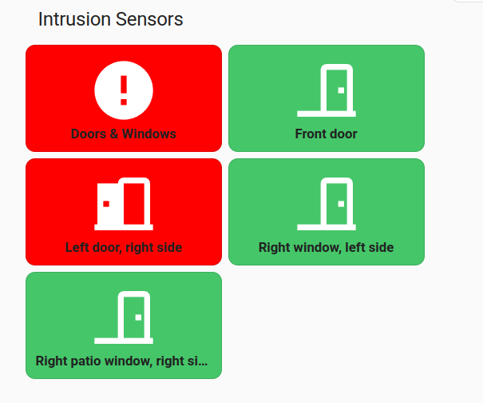

# IntrustionSensorGrid



```yaml
type: custom:button-card
entity: binary_sensor.door_window_sensors
name: Doors & Windows
styles:
  card:
    - padding: 12px
  name:
    - font-weight: bold
state:
  - value: "on"
    color: white
    styles:
      card:
        - background-color: "#ff0000"
  - value: "off"
    color: white
    styles:
      card:
        - background-color: "#45c669"
  - value: unavailable
    color: black
    styles:
      card:
        - background-color: "#ffa500"

```
